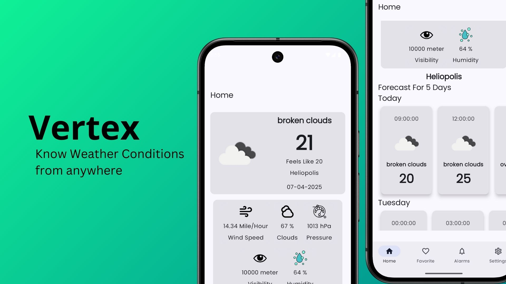
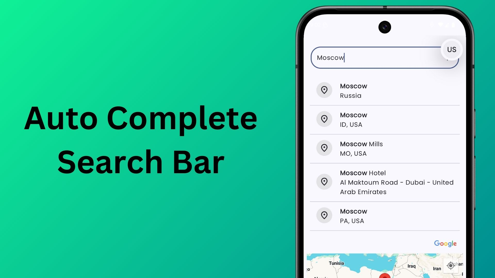
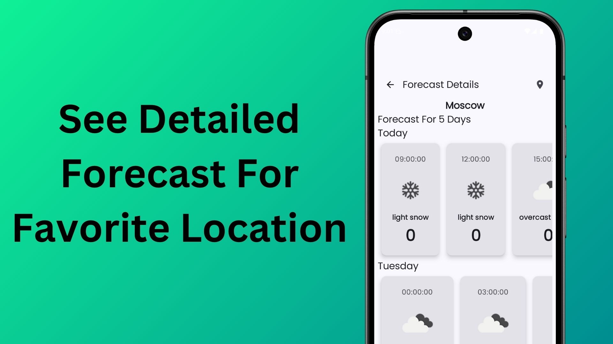
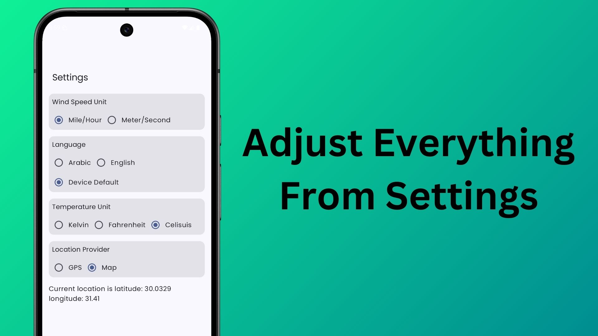
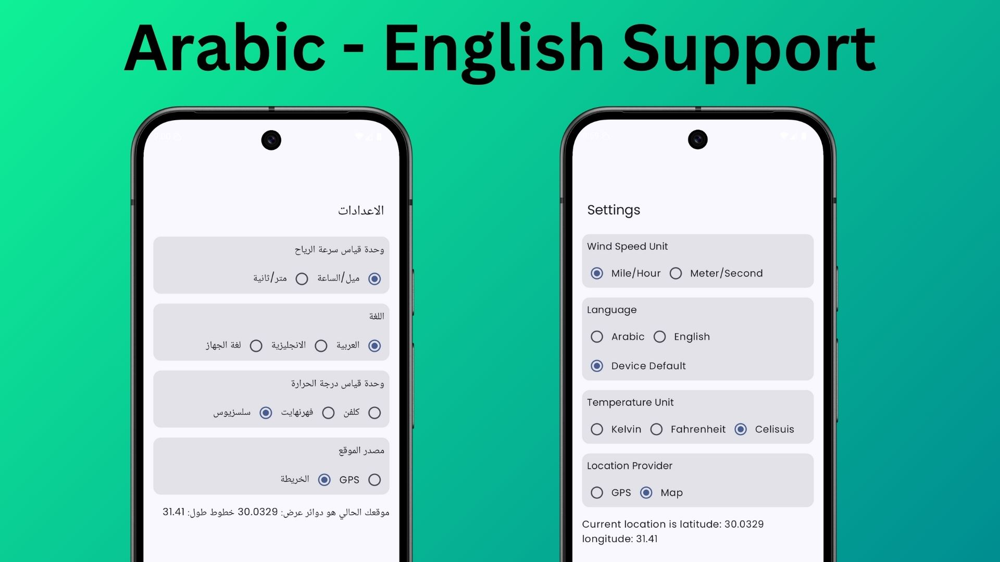
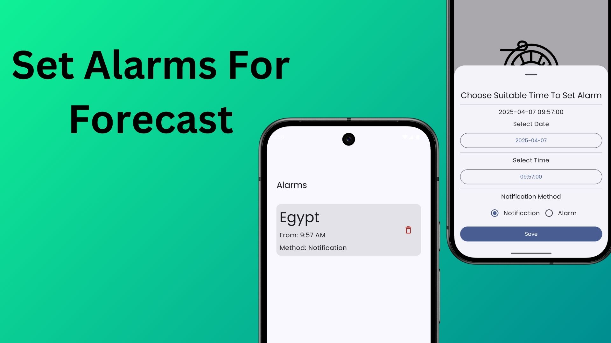

# Vertex 
Vertex is a weather forecasting app that provieds you by up-to-date data about any place in the world



# Features
## Get Current Weather Conditions (temperature, humidity, wind speed, status and more)


## Manage your favorite Locations
  - Add New Location to Favorite
  - Delete Location From Favorite


## Pick Location From Map using Google Maps Integration


## Search By Place name using our AutoComplete Search bar



## Show Detailed Forecast for next 5 Days



## Adjust Temperature Unit, Wind speed Unit, Language, Location Provider (Map/GPS)



## Support for English And Arabic



## Set Alarms To Inform you about Forecast In your Favorite Location



## Choose Method Notification Methods (Notification / Alerts Over other Apps)


# How To Run Vertex
1. clone the project from Github
2. Vertex uses 2 API the first one for forecast and weather conditions from [Open Weather](https://openweathermap.org/). vertex uses **Free API end Points** so you don't need to add any cridet card to Open Weather.
3. on `local.properties` file you need to add your api key like the following 

```python
# local.properties file
# replace **** with your api key 
API_KEY=**********
```

1. create `secrets.properties` file on top level in the project just beside `local.properties` file. **Don't get confused between `local.properties` and `local.defaults.properties` file. those are different files. they live beside each other.**
2. add Google maps sdk API key to `secrets.properties` file. **NOTE: This file will be ignored by Git. so your api key is safe**
```python
# secrets.properties file
# replace ****** with your api key
MAPS_API_KEY=********
```

>> the Api key that you have added to Google Maps Must have Maps Sdk Enabled and Places New Api Enabled

3. Enjoy Vertex


# Tech Used
- Kotlin Programming Language
- Jetpack compose for Ui
- MVVM Architecture
- Unit Testing for Android
- DataStore For Handling Settings
- Coroutines And Flows
- Work Manager
- Alarm Manger (Replaced by WorkManager in the latest version)
- Google Maps Sdk
- FusedLocationClient
- Retrofit
- Room
- Compose Navigation (TypeSafe Navigation)

# Other Developers

For Full Architecture Details. you can find file called `Vertex.drawio` in `media/` folder. open it in drawio app and you can find all needed details inside the second page under title architectrue.


